<div align="center">


<br/>

<a href="https://github.com/binedwin/Portfolio">
  
</a>
<a href="https://github.com/binedwin">
  
</a>

<br/><br/>


</div>

---

## 🌌 About Me

```text
🌙  Robot Software Developer
🤖  Interested in Robotics, Vision, and AI
🛰️  Building systems that connect perception, control, and real hardware
🌱  SSAFY Embedded Robot Track
```

> **Every commit becomes a star.**  
> 작은 구현을 하나씩 쌓아, 실제 세계와 상호작용하는 지능형 시스템을 만들고 있습니다.

---

## 🪐 Tech Orbit

<div align="center">

### Robotics & Embedded


### Vision & AI


### Software


</div>

---

## 🚀 Featured Constellations

<table>
<tr>
<td width="50%" valign="top">

### 💊 [Hospital Robot Delivery System](https://github.com/binedwin/Pill-delivery)

`ROS2` `YOLO` `RealSense` `Dobot` `TurtleBot` `Vue`

약품 인식·분류부터 Dobot Pick & Place, 컨베이어 검수, TurtleBot 배송까지 연결한 **End-to-End 병원 로봇 시스템**입니다.

</td>
<td width="50%" valign="top">

### 💧 [Water Leak AI](https://github.com/binedwin/waterleak)

`Python` `Scikit-learn` `KNN` `LangGraph`

상수관로 진동 데이터를 분석해 누수를 판별하고, 상태 머신 기반으로 현장 대응까지 연결하는 **AI 파이프라인**입니다.

</td>
</tr>
<tr>
<td width="50%" valign="top">

### 🐾 [AI Animal Character](https://github.com/binedwin/tattoo)

`MediaPipe` `ResNet34` `Generative AI` `Flask`

얼굴 특징 분석과 딥러닝 분류, 생성형 AI를 연결해 개인화된 동물 캐릭터를 만드는 **Vision AI 서비스**입니다.

</td>
<td width="50%" valign="top">

### 🧠 [Memory Archive](https://github.com/binedwin/Memory-Archive)

`RAG` `Vision AI` `STT/TTS` `LLM`

과거 사진을 기반으로 회상 대화를 돕는 **RAG + Vision 기반 치매 예방 AI 서비스** 프로젝트입니다.

</td>
</tr>
</table>

<div align="center">
  <a href="https://github.com/binedwin?tab=repositories">
    
  </a>
</div>

---

## ✨ Contribution Galaxy

<div align="center">

<sub>GitHub Actions가 매일 contribution 데이터를 읽어 별자리로 다시 그립니다.</sub>
</div>

---

## 📊 GitHub Signals

<div align="center">


</div>

---

<div align="center">

</div>
